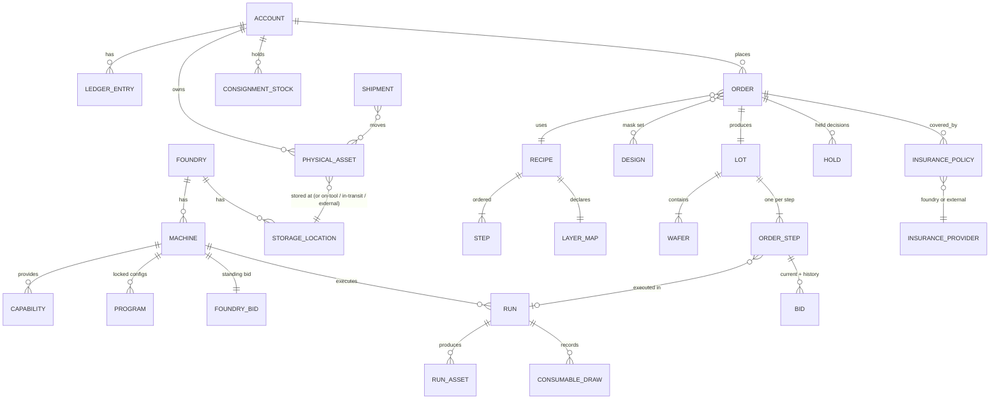
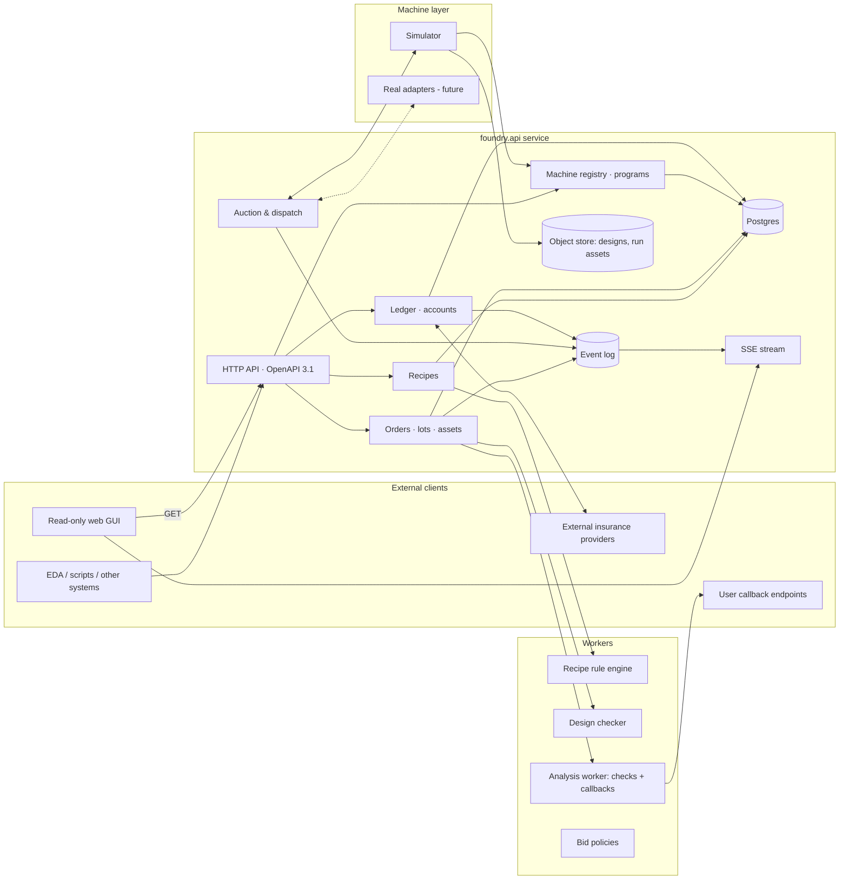

# foundry.api — Design Document (Draft v0.2)

_Open, auction-scheduled silicon/MEMS foundry orchestration prototype_

|  |  |
| --- | --- |
| Status | Draft v0.2 |
| Date | 2026-09-12 |
| License | Apache 2.0 (code, schemas, docs) |

> **Foundry in the cloud: make a chip, quick.** Anyone can design a chip now; everyone should be able to make one. Today's fabs are run by three big, high-touch customers. foundry.api is the software for running a fab the other way — for a large number of small, low-touch customers: fabrication as a service with no custom engineering, every machine's time auctioned openly to the highest bidder, and everything — queues, prices, tool states, results — public.

* * *

## 0. Summary

foundry.api is an API-first service for running an open, auction-scheduled foundry. It lets anyone:

*   **Define a recipe** — an ordered list of process, metrology, analysis and logistics steps executed on the foundry's machines, built from forkable templates, and checked against rules whose only purpose is to protect the foundry's machines.
*   **Order a recipe** against a design (GDS), a set of physical assets (wafers and masks — foundry-supplied or shipped in) and a bid schedule.
*   **Have every step scheduled by auction** — each machine continuously sells its next slot to the highest bidder. The foundry itself is a bidder, setting a floor or paying to keep expensive-to-stop tools running.

Everything is public: machines and their programs, live auctions, what is on every tool, storage, ledgers and run assets. A read-only web GUI renders this state; all writes go through the API.

* * *

## 1. Motivation

Anyone can design a chip now; almost nobody can get one made quickly. The typical fab earns ~70 % of its revenue from three customers, who use that leverage to compress margins, and it is organisationally hostile to adding small customers because every new customer means custom engineering (NRE). Academic nanofabs absorb a few thousand designs a year but are slow and non-commercial.

foundry.api exists to run a foundry the opposite way:

*   **Many customers, less bespoke work.** Fabrication as a service: fixed machine programs and forkable templates instead of per-customer process development. The foundry sells qualified capabilities, not engineering hours.
*   **Machine time as an open market.** Like a compute spot market, every tool's next slot is auctioned publicly to the highest bidder; the foundry participates with its own bids rather than negotiating contracts.
*   **Speed as the product.** Faster iteration _is_ better design. The system is built to make cycle time visible and biddable, so a customer can buy speed when they need it.
*   **Transparency as the customer-acquisition strategy.** Publishing every queue, price, and machine state removes the information asymmetry that makes fabs unapproachable.

The longer-term direction is silicon as a cloud service: designs go in, measured data (e-test, probe, characterisation) comes out, and physical delivery becomes optional.

* * *

## 2. Goals, non-goals, principles

### 2.1 Goals

1.   **Recipe authoring via API** from typed steps and forkable templates. Steps target a capability and may be locked to one machine or a set.
2.   **Machine-protection validation only.** Recipes and designs are checked against rules that keep tools safe (limits, chemistries, contamination, form factor, pattern density, program compatibility). Nothing checks whether the _device_ will work — that is the user's responsibility.
3.   **Orders with designs and physical assets.** Designs are public GDS/OASIS. Wafers and masks are tracked assets with owners, locations and storage charges.
4.   **Money-only auction scheduling.** Highest bid runs next; the foundry bids too (reserve or subsidy); prices can be negative. If a lot is blocked because its owner won't pay, that is the intended outcome.
5.   **Runs produce assets** (images, tables, logs, actual durations, consumable draws). Recipes can include metrology, analysis and halt conditions; a fired halt places the order in `held` until the owner decides.
6.   **Machine registry, programs, consumables, utilisation, ledger** — all public.
7.   **No new languages or formats.** Documents are YAML/JSON with JSON Schema. Assets use PNG/CSV/Parquet/JSON/NDJSON. Expressions, where unavoidable, use an existing sandboxed language or are delegated to callbacks.
8.   **Read-only GUI.**

### 2.2 Design targets

Numbers the architecture, auction and GUI metrics should be judged against (from the motivating vision; not prototype requirements):

| Target | Value | Where it shows up |
| --- | --- | --- |
| Customers | ~7,000 accounts at ~100 wafers/yr each | account and asset model scale; no per-customer configuration anywhere |
| Throughput | ~700,000 wafers/yr (gigafab-comparable) | event log and projection volumes; batch tools |
| Cycle time | ≤ 5 weeks order-to-data for a standard template | `projected_complete` on every order; cycle-time percentiles per template on the overview page |
| NRE | zero — templates + programs only, no custom process work | `programs_only` default (§5.1); templates as the primary path (§7) |
| Node focus | mature nodes: analog, power, industrial, secure silicon | shipped templates; SKY130 as the complex reference |

### 2.3 Non-goals (prototype)

*   Real tool control (SECS/GEM, OPC-UA). The prototype ships a simulator behind the adapter interface.
*   Confidentiality. Nothing is private except API secrets and webhook URLs.
*   Real payments. Credits are abstract; prepaid and postpaid _enforcement_ are demonstrated so a real foundry can plug in billing.
*   Physics/TCAD, yield prediction, DRC-for-yield.

### 2.4 Principles

*   API is the product; GUI is a viewer.
*   Versioned, immutable, content-addressed documents.
*   Explainable rejections: rule id, subject, measured value, limit, hint.
*   Deterministic, replayable scheduling from an append-only event log.
*   Boring technology: Postgres, one service, HTTP+JSON, SSE.

* * *

## 3. Reference processes

**Simple — Science Corp. TFE flow.** 3 masks (+ helper levels), 16 steps, 6-inch 500 µm fused silica: polyimide spin/cure, bilayer resist, contact litho, Ti/Pt/Au evaporation, lift-off, hard-mask etch, laser release. Shipped as template `tpl_tfe-3mask`.

**Complex — SkyWater S8/SKY130.** ~200 steps of `<mask> → <implant|etch> → <strip>` triplets between oxidations, LPCVD depositions, CMP and RTA anneals. Shipped as a ~40-step front-end excerpt `tpl_sky130-fe` using macros.

What they force into the model: linear step lists with macros; coupling windows between steps (resist coat → expose; HF dip → deposition); batch tools (furnaces, wet benches, implanters); contamination classes (no gold in front-end tools); fixed furnace programs (a tube that only runs its qualified 10-hour cycle); per-layer mask metadata; metrology after critical steps (film thickness after oxidation, sheet resistance after implant/anneal) with halt thresholds.

* * *

## 4. Glossary

| Term | Meaning |
| --- | --- |
| **Foundry** | One facility. One per deployment. Also an _account_ that can bid. |
| **Account** | Anyone who can own assets, hold credits and bid: users (by API key) and the foundry itself. |
| **Machine** | A physical tool. Has capabilities, programs, limits, consumables, a foundry bid, state. |
| **Capability** | Typed thing a machine can do (`deposit.pvd.evaporation`). Steps request capabilities. |
| **Program** | A named, locked configuration on a machine (`furnace-A/bake_10h`). Steps may run "free" params within a capability's limits, or a program with fixed params. |
| **Consumable** | Something drawn per run: gas, chemical, resist, target, substrate wafer, mask blank, chamber hours. Charged in one of three modes (§11). |
| **Asset (physical)** | Wafer, lot, mask, carrier. Has owner, location, storage class, charges. |
| **Asset (run output)** | File produced by a run: image, table, log, telemetry, report. Public. |
| **Design** | Uploaded GDSII/OASIS + layer inventory. Public. |
| **Step** | Atomic recipe element: process, metrology, analysis, logistics or manual. |
| **Recipe / Template** | Ordered steps + layer map + wafer spec + asset requirements. Immutable once published. |
| **Order → Lot → Order-step** | An order produces a lot (wafers); each recipe step becomes an order-step, the unit that is bid on and scheduled. |
| **Bid** | `max_price_per_wafer` an account will pay for an order-step to run next. |
| **Foundry bid** | A per-machine standing bid by the foundry: positive = reserve, negative = subsidy. |
| **Auction / Slot / Run** | Per-machine ordering of eligible order-steps → the next execution → the execution with telemetry and outputs. |
| **Halt** | A condition evaluated on run outputs; if true, the order goes to `held`. |
| **Ledger** | Append-only account entries: bids cleared, consumables, storage, shipping, insurance, claims, subsidies. |
| **Contamination class** | Ordered label on wafers and machines: `clean < poly < metal_std < gold`. |

* * *

## 5. Domain model

mermaid



### 5.1 Machine (with programs and foundry bid)

yaml

```yaml
id: mach_furnace-A
name: "Furnace tube A (wet/dry oxidation)"
kind: thermal.furnace
wafer_sizes_mm: [150]
contamination_class: clean
batch: {size: 25, carrier: quartz_boat_25, min_fill: 5, max_wait_s: 14400}
capabilities:
  - id: thermal.oxidation
    mode: programs_only              # free | programs_only | both
  - id: thermal.anneal.furnace
    mode: programs_only
programs:                            # locked configurations; a step references one by id
  - id: dry_ox_900_20nm
    capability: thermal.oxidation
    params: {temp_c: 900, ambient: dry_O2, time_min: 45, ramp_c_per_min: 10}   # constants
    duration_s: 10800                # includes push/pull/ramp — authoritative, not estimated
    rate_credits_per_run: 400        # bundled machine time + bundled consumables (O2, N2, quartz wear)
    metered_consumables: []          # none pass-through for this program
  - id: bake_10h
    capability: thermal.anneal.furnace
    params: {temp_c: 1000, ambient: N2, time_min: 600}
    duration_s: 43200
    rate_credits_per_run: 1800
limits:                              # machine-protection hard limits (still enforced even for programs)
  max_temp_c: 1150
  forbidden_wafer_materials: [Au, Cu, Al, photoresist, polyimide]
foundry_bid:                         # the foundry's standing bid in this machine's auction
  mode: subsidy                      # reserve | subsidy | none
  credits_per_wafer: -6.0            # negative: it costs ~150 cr/h to keep the tube hot idle; better to run at a loss
  note: "Tube must stay at temperature; cooling/reheating costs ~12 h of qualification"
setup_matrix: {dry_ox_900_20nm→bake_10h: 1800, bake_10h→dry_ox_900_20nm: 3600}
state: {status: running, run_id: run_…, program: dry_ox_900_20nm, since: …}
```

Machines whose capability `mode: free` expose a params JSON Schema with limits; `both` lets a step either pick a program or supply params within limits. **Programs are the normal case**: a fixed catalogue of qualified configurations is what lets the foundry serve thousands of customers with no per-customer engineering (§1). Free params are the exception, for tools like RIE where users legitimately tune within a safe envelope.

### 5.2 Step (in a recipe) — process, with pinning and coupling

yaml

```yaml
- id: BOX
  type: thermal.oxidation
  capability: thermal.oxidation
  machines: [mach_furnace-A]          # pin to one; or a list; or omit for "any machine with the capability"
  program: dry_ox_900_20nm            # locked config; params come from the program
  depends_on: SMAT
  max_queue_time_from_prev_s: 172800  # coupling window; on breach → order held (§10.6)
  outputs: []                         # expected run assets (declared by the program/type; may add more)
  default_bid_credits_per_wafer: 8
```

### 5.3 Step — metrology, analysis, halt

yaml

```yaml
- id: BOX_thk
  type: metrology.thickness
  capability: metrology.ellipsometry
  program: sio2_on_si_9pt
  depends_on: BOX
  outputs:
    - {name: thickness_map, format: csv, schema: metrology.thickness_map/v1}   # columns: wafer_id, site, x_mm, y_mm, thickness_nm
    - {name: raw, format: json}
- id: BOX_check
  type: analysis.check                # no machine; runs on the analysis worker
  depends_on: BOX_thk
  inputs: [BOX_thk.thickness_map]
  checks:                             # declarative, no expression language needed for the common case
    - {id: thk_mean,  stat: mean, field: thickness_nm, min: 18.5, max: 21.5, unit: nm}
    - {id: thk_range, stat: max_minus_min, field: thickness_nm, max: 2.0, group_by: wafer_id}
  on_fail: hold                       # see §10.7
  outputs: [{name: report, format: json, schema: analysis.check_report/v1}]
- id: BOX_custom
  type: analysis.callback             # delegate anything richer to a callback
  depends_on: BOX_thk
  inputs: [BOX_thk.raw]
  callback: {url: https://example.org/foundry-hooks/box-analysis, timeout_s: 300, signing_key_id: k_…}
  on_fail: hold
```

### 5.4 Step — logistics

yaml

```yaml
- id: MASKS
  type: logistics.mask_fab            # foundry orders photomasks from the design
  vendor: maskco                      # from the foundry's vendor list, with lead time & price per layer
  layers: [METAL1, OUTLINE1, TOPMETAL]
  spec: {blank: "5in quartz Cr", min_feature_um: 2.0}
- id: IN_INSPECT
  type: logistics.receive_inspect     # gate for anything arriving: user-shipped wafers/masks, external returns
  capability: metrology.incoming
  program: wafer_incoming_std         # visual, thickness, bow, flat orientation, contamination swab
  outputs: [{name: inspection, format: json, schema: logistics.inspection/v1}]
  on_fail: hold
- id: EXT_ALD
  type: logistics.external_process    # ship out, have something done, come back
  vendor: aldhouse
  shipment: {carrier: ups, service: express, insured: true}
  expected_turnaround_days: 7
  returns_to: IN_INSPECT_2            # every external return must be followed by receive_inspect
- id: SHIP
  type: logistics.ship_out            # outgoing shipping is part of the recipe
  destination: {account_address_ref: primary}
  packaging: wafer_carrier_25_n2
```

### 5.5 Physical assets

yaml

```yaml
id: wfr_01J8…
kind: wafer                          # wafer | mask | carrier
owner: acct_9f3e
lot: lot_01J8…
scribe: "FA-2026-09-0442-07"
spec: {material: fused_silica, diameter_mm: 150, thickness_um: 500}
state: {contamination_class: gold, materials: [Ti, Pt, Au, polyimide], resist_present: false}   # maintained by the wafer-state engine
location: {kind: storage, id: stor_n2cab-3, since: 2026-09-12T13:20:00Z}   # storage | on_tool | in_transit | external | disposed | shipped
storage_class: n2_cabinet             # drives the charge rate
provenance: foundry_supplied          # foundry_supplied | user_shipped | external_returned
history: [...]                        # every location change is an event
```

Masks are the same shape with `kind: mask`, `layer: METAL1`, `design: des_…`, `vendor_order: …`, `storage_class: mask_box`, and usage counts. A mask is a reusable asset: the same owner may reference it in later orders instead of paying for `logistics.mask_fab` again.

### 5.6 State machines

**Order**

```
draft ─submit─▶ validating ─ok─▶ awaiting_assets ─assets ready─▶ in_progress ─all steps done─▶ complete
                    │                (masks fabbed, wafers received & inspected)  │   ▲
                    └─reject─▶ rejected                                           ▼   │ resume/rework
                                                              held ◀──(halt / coupling breach / failed run / out of credit)
                                                               │ timeout or owner abort
                                                               ▼
                                                            aborted ──▶ (assets remain in storage, charged, until shipped or disposed)
```

**Order-step**

```
blocked ─prev done─▶ eligible ─auction win─▶ queued ─start─▶ running ─▶ done
                        ▲                                     │
                        └──── (owner: rework_to_step) ◀── held ◀┘ (fail / halt)
```

`eligible` has a visible sub-state: `eligible.unfunded` (bid below reserve or account cannot cover it — it is listed in the auction but never wins).

**Machine**: `idle ⇄ setup ⇄ running`; any → `maintenance` | `down` → `idle`. Plus `offline_by_bid` when the foundry's reserve exceeds every bid (that is what "keep the machine offline by bidding" looks like).

* * *

## 6. Architecture

mermaid



**Language:** Python (FastAPI, Pydantic v2, SQLAlchemy/asyncpg, Postgres, `gdstk`/KLayout for GDS inventory and geometry checks, `pytest`). Scheduler is a pure module with no I/O so it could be ported to Go. Go-first alternative: keep the design checker and analysis worker as a Python sidecar. GUI: static TypeScript, `GET` + SSE only.

**Repository:**`foundry.api/` with `schemas/` (JSON Schema for every document), `templates/`, `rulesets/`, `foundries/demo/`, the Python package `foundryapi/` (`api`, `recipes`, `validation`, `orders`, `assets`, `scheduler`, `ledger`, `insurance`, `analysis`, `registry`, `sim`, `events`), `web/`, `tests/`, `docs/`.

* * *

## 7. Recipes

### 7.1 Document

YAML/JSON validated against `schemas/recipe.schema.json`. Published recipes are immutable, versioned, content-hashed.

yaml

```yaml
schema: foundry.api/recipe/v1
name: tfe-3mask
version: 3
forked_from: tpl_tfe-3mask@2
wafer: {material: fused_silica, diameter_mm: 150, thickness_um: 500, polish: DSP, initial_contamination_class: clean}
assets_in:                                   # what the order must provide before step 1 can become eligible
  wafers: {source: [foundry_supplied, user_shipped], min: 1, max: 25}
  masks:  {source: [mask_fab, user_shipped, existing_asset], layers: [METAL1, OUTLINE1, TOPMETAL]}
layer_map:                                   # machine-protection metadata only: gds → name, polarity, which tool consumes it
  - {name: METAL1,   gds: [10, 0], polarity: light, required: true}
  - {name: VIA,      gds: [20, 0], polarity: dark,  required: true}
  - {name: OUTLINE1, gds: [20, 1], polarity: dark,  required: true}
  - {name: OUTLINE2, gds: [21, 0], polarity: dark}
  - {name: TAB,      gds: [22, 0], polarity: light}
  - {name: TOPMETAL, gds: [30, 0], polarity: light, required: true}
  - {name: RELEASE,  gds: [40, 0], polarity: light, required: true}
  - {name: XZONE,    gds: [41, 0], polarity: dark}
steps: [ ... ]                               # §5.2–5.4
```

Note the layer map no longer carries min width/space: those are yield rules and are the user's problem (§9). It carries what the foundry needs to protect tools: which layer feeds the laser (area limit), which is etched (density limit), polarity (mask-fab spec).

### 7.2 Step types (v0.2 catalogue)

| Family | Types | Notes |
| --- | --- | --- |
| `coat.*` | `coat.spin`, `coat.spray` |  |
| `litho.*` | `litho.expose_develop`, `litho.expose`, `litho.develop`, `litho.direct_write` | direct-write consumes a design layer, no mask asset |
| `deposit.*` | `pvd.evaporation`, `pvd.sputter`, `cvd.lpcvd`, `cvd.pecvd`, `ald`, `epi` |  |
| `thermal.*` | `oxidation`, `anneal.furnace`, `anneal.rta`, `cure`, `bake` | usually `programs_only` |
| `etch.*` | `rie`, `drie`, `wet`, `ion_mill`, `xef2` |  |
| `strip.*` | `wet`, `ash` |  |
| `implant.*` | `ion` |  |
| `planarize.*` | `cmp` |  |
| `clean.*` | `rca`, `piranha`, `solvent`, `hf_dip` |  |
| `metrology.*` | `thickness`, `profilometry`, `sem`, `optical`, `probe` (e-test), `sheet_resistance`, `incoming` | always declare `outputs` |
| `analysis.*` | `check` (declarative stats vs. limits), `callback` (delegated), `expr` (optional CEL, §13) | no machine; `on_fail: hold` |
| `logistics.*` | `mask_fab`, `receive_inspect`, `external_process`, `ship_out`, `store` (explicit long-term storage with class) |  |
| `backend.*` | `dice`, `release.laser`, `wafer_bond` |  |
| `manual.*` | `inspect`, `note`, `operator_task` | scheduled on the `operator` pseudo-machine at its rate |

### 7.3 Macros, versioning, forking

YAML macros expanded at publish time; drafts mutable, publish freezes and assigns a version; forks carry lineage; any recipe referenced by an order is permanent.

* * *

## 8. Recipe validation (machine protection)

Rules are versioned documents in `rulesets/machine-protection.yaml`, evaluated against the expanded recipe, the machine registry (including programs) and a simulated wafer state threaded through the steps. **Rules protect machines, consumables and shared infrastructure — never the user's device.**

Rule bodies are written in the evaluator chosen in §13; the schema is evaluator-agnostic:

yaml

```yaml
schema: foundry.api/ruleset/v1
name: machine-protection
version: 8
rules:
  - id: MP-001  # Params within limits (free-mode capability) or program exists on a candidate machine
    scope: step
    severity: error
    evaluator: builtin              # a handful of rules are implemented in code because they are structural
    check: params_or_program_valid
  - id: MP-010  # Contamination class of wafer ≤ every candidate machine's class
    scope: step
    evaluator: builtin
    check: contamination_compatible
  - id: MP-011  # Forbidden wafer materials for machine
    scope: step
    evaluator: cel
    expr: "!machine.limits.forbidden_wafer_materials.exists(m, m in wafer.materials)"
  - id: MP-020  # No resist/polyimide into any step > 150 °C
    scope: step
    evaluator: cel
    expr: "!(step.effective_params.temp_c > 150 && (wafer.resist_present || 'polyimide' in wafer.materials))"
  - id: MP-030  # Flammable + oxidiser gas combos
    scope: step
    evaluator: cel
    expr: "!(('H2' in step.effective_params.gases && 'O2' in step.effective_params.gases) || ('SiH4' in step.effective_params.gases && 'O2' in step.effective_params.gases))"
  - id: MP-040  # Duration ≤ machine max continuous run
  - id: MP-050  # Wafer diameter supported by every pinned/candidate machine
  - id: MP-060  # Pinned machine actually provides the capability/program
  - id: MP-070  # Every external_process is followed by receive_inspect before any tool step
  - id: MP-080  # Every logistics.mask_fab layer exists in layer_map; polarity matches vendor spec
  - id: MP-090  # Coupling window ≥ program duration of predecessor's successor setup (warning)
  - id: MP-100  # Consignment consumables referenced by a step exist in the owner's consignment stock (checked at order time)
```

`step.effective_params` = program params when a program is used, else the step's own params. The wafer-state engine (contamination class, materials, resist present, stack, thickness) is also persisted per physical wafer (§5.5), so incoming-inspection results can overwrite it (a user-shipped wafer arrives with gold on it → it can never enter `clean` tools, regardless of what the recipe claims).

Validation reports carry `rule, severity, subject, measured, limit, message, hint` per finding; errors block publish; reports are public and permanent. Rules are re-evaluated at dispatch time against the machine revision in force; a failure blocks the step and holds the order.

* * *

## 9. Designs and design checks (machine protection only)

`POST /designs` stores the GDS/OASIS content-addressed, extracts layer inventory, hierarchy, bbox, polygon count, renders previews, and publishes it. On `POST /orders` (or standalone `POST /designs/{id}/check?recipe=`), two passes run:

**Layer-map conformance (`LM-*`)** — required layers present; unknown layers warned and ignored; bbox within wafer usable area and edge exclusion; unique top cell.

**Machine protection (`MK-*`)** — computed with `gdstk` booleans on the layers the recipe says feed each tool:

| Rule | Protects |
| --- | --- |
| `MK-001` per-layer pattern density in machine-declared `[min,max]` per window | etch loading, CMP dishing, evaporator source burn-through |
| `MK-002` no geometry in the tool's edge-exclusion ring | handlers, chucks, clamps |
| `MK-003``RELEASE ∩ XZONE = ∅`; `RELEASE` area ≤ laser `max_release_area_mm2` | laser release optics/stage |
| `MK-004` min trench width vs. DRIE aspect-ratio ceiling | endpoint detection, chamber |
| `MK-005` vertex/polygon count ≤ direct-write ceiling | writer time bound |
| `MK-006` mask-fab: min feature ≥ vendor min for the chosen blank | prevents unfillable mask orders |
| `MK-007` no geometry on layers the recipe never consumes (warning) | catches layer-number mistakes that would waste a mask |

There is **no DRC for yield**. The repo may ship the foundry's _advisory_ KLayout deck as a downloadable file for users to run themselves, but the server never gates on it. This is a deliberate liability boundary and is stated on every design page.

* * *

## 10. Auction and scheduling

### 10.1 Principle

Every machine sells its next slot to the highest bidder, the way a compute spot market sells instances. Bids are money; nothing else reorders the queue. An order-step whose owner won't pay enough simply waits, visibly, forever — while its wafers accrue storage charges.

### 10.2 Bidders

*   **Order-steps** that are `eligible`: predecessor done, assets present, account able to fund the bid (§12).
*   **The foundry**, via each machine's `foundry_bid`: 
    *   `reserve` (positive): "don't run anyone below X". If no bid ≥ X, the machine idles (`offline_by_bid`). This is how a foundry takes a machine out of service gracefully, or refuses to run cheap jobs before scheduled maintenance.
    *   `subsidy` (negative): "I would rather pay up to |X| per wafer than have this tool stop". Used for furnaces, epi reactors, anything with expensive shutdown/qualification cycles.
    *   `none`: reserve is the program's bundled cost (foundry breaks even).

A foundry bid is public and appears in the queue like any other row.

### 10.3 Clearing rule (per machine, on every relevant event)

```
E = eligible order-steps s with M ∈ machines(s) and s not queued elsewhere and funded(s)
F = foundry_bid(M)                                    # may be negative
rank E by bid(s) desc, ties by eligible_since asc      # nothing else
if M.batch.size > 1: form the largest batch from the top of E whose members share a program
                     (wait up to batch.max_wait_s from the first eligible if fill < min_fill)
winner W = top of E (or the batch)
if bid(W) < F: no clearing; machine is offline_by_bid (or idle if F ≤ 0 and E empty)
price(W) = max(F, next_highest_bid_after_W)           # second price with the foundry as a participant
           # for a batch: every member pays max(F, highest bid *outside* the batch); see §10.5
consumables: bundled ones are inside F's baseline; metered ones are added at actual draw at run end (§11)
emit auction.cleared {machine, winners, price, foundry_bid, losers_snapshot}
```

`price` can be **negative**: if `F = −6` and there is no other bidder, `price = −6` and the winner is credited 6 cr/wafer for running (§10.4 shows why this is rational for the foundry). Metered consumables are still charged separately, so a user cannot profit by burning gold.

### 10.4 Pricing-rule analysis

| Rule | Incentive for bidders | API churn | Foundry control | Batch tools | Verdict |
| --- | --- | --- | --- | --- | --- |
| **First-price** | Shade bids just above the next competitor; requires watching the queue | High (constant re-bidding) | Reserve only | Every member pays own bid — simple | Simple to explain; poor for headless clients |
| **Second-price (Vickrey), foundry as participant** | Bid true value once | Low | Reserve _and_ subsidy fall out naturally: the foundry's bid is just another bid that sets the floor | Needs a batch rule (§10.5) | **Recommended default** |
| **Uniform-price batch auction** (all winners in a batch pay the highest losing bid) | Truthful for single units | Low | Same | Natural | Adopted _for batches_ within second-price |
| **Time-window reservations** (reserve a 2 h block) | Predictability | Low | Weak — blocks the tool | Awkward | Deferred; can be emulated with a high bid + `not_before` (Q1 in §18) |

Why second-price works with a negative foundry bid: the foundry's subsidy is its _true valuation_ of keeping the tool running (avoided shutdown cost per wafer). Second-price with the foundry bidding its true value means the tool runs exactly when society (foundry + users) values running it more than idling — including when the user's valuation is small and the foundry tops it up.

**Manipulation notes.** A user can't lower the price by bidding through several keys (second price only counts _distinct competing_ bids, and shills only raise prices). A foundry could overstate a subsidy — but it pays it. Cancelling a `queued` step forfeits the cleared price (§16).

### 10.5 Batch tools

A batch clears as a set of order-steps on the same program. Each member pays `max(F, highest bid not in the batch)` — a uniform price, so nobody inside the batch pays more than the marginal outsider they displaced. A lot can span multiple batches (split lots are tracked as child lots). Batch waiting is bounded by `max_wait_s`; below `min_fill` the foundry decides through its bid whether to run partially (a subsidy makes partial runs happen; a reserve prevents them).

### 10.6 Coupling windows and other time limits

With no deadline boost, a coupling window (`max_queue_time_from_prev_s`) is just information: projections show "must start by 15:30". If it is breached, the order-step **fails** and the order goes to `held` with reason `coupling_breach`; the owner picks continue-anyway / rework-to-step / abort. The owner pays for the rework steps at auction like any other steps. There is no free rework.

### 10.7 Halts and the `held` state

Any of these put an order in `held`: an `analysis.*` step's `on_fail`, a coupling breach, a run outcome `fail`, an incoming inspection failure, a dispatch-time revalidation failure, or an account that cannot fund the next step (`unfunded` for longer than `foundry.unfunded_hold_after_s`). While held:

*   wafers/masks sit in storage at their class rate (charged to the owner);
*   the owner resolves via `POST /orders/{id}/holds/{hold_id}/resolve` with `{action: continue | rework_to_step, step_id | abort, note}`;
*   `foundry.hold_timeout_s` (e.g. 14 days) auto-aborts; assets then keep charging until shipped (`ship_out` can be ordered standalone) or, after `foundry.abandon_after_s`, are disposed and the account is closed out.

All hold events, decisions and notes are public.

### 10.8 Bid policies (server-side, optional)

`none` (default), `deadline` (raise the critical-path step's bid to `price_to_lead` when projected completion slips past target, within a budget), `budget` (spread a budget across remaining machine-hours). Policies place ordinary bids, emitting `order_step.bid_changed {placed_by: policy:…}`.

### 10.9 Projections

For every order-step: expected start (given current bids and program durations), `price_to_lead` per candidate machine, and `must_start_by` from coupling windows. Recomputed on every clearing, streamed via SSE.

### 10.10 Worked example (furnace with subsidy, batch of 25)

Furnace A idle, `F = −6`, program `dry_ox_900_20nm`, min_fill 5, 14 wafers eligible across 3 lots bidding 9, 8 and 4 cr/wafer; one outside bidder (different program) at 3.

*   Batch = all 14 wafers (same program, ≤ 25). Highest bid outside the batch = 3. Price = max(−6, 3) = **3 cr/wafer** for everyone in the batch.
*   Had there been no outside bidder: price = max(−6, none) = **−6** → each wafer's owner is _credited_ 6 cr; the foundry pays 84 cr rather than let the tube cool.
*   Had the foundry set `reserve +20`: nobody clears; the tube shows `offline_by_bid`, with the queue and the 20 cr floor visible to all.

### 10.11 Determinism

`scheduler.decide(state, event, clock) -> [Decision]` is pure; the demo event log replays to byte-identical `auction.cleared` events.

* * *

## 11. Machines, programs, consumables, storage, utilisation

### 11.1 Consumable charging modes

| Mode | Where the cost lives | Example | Charged how |
| --- | --- | --- | --- |
| **bundled** | inside a program's `rate_credits_per_run` (or a free-mode capability's `rate_credits_per_hour`) | furnace O2/N2, quartz wear, RIE SF6 at nominal flow, electricity, chamber hours | Part of the foundry's floor; no separate line item. The foundry sets the rate from historical draw. |
| **metered** | pass-through at actual draw × unit cost | evaporated Au/Pt (grams, wafer-dependent), mask blanks, substrate wafers, custom targets | Separate ledger line at run end (`consumable.metered`); _estimated_ at validation for the projection. |
| **consignment** | customer-owned stock held at the foundry | customer's own 4-inch SOI wafers, their proprietary resist, their sputter target | No unit charge; stock decremented from `CONSIGNMENT_STOCK(account, consumable)`; storage charged by class; step validation fails at order time if stock is insufficient (`MP-100`). |

Each consumable in a machine's rate table declares `mode` and, for metered ones, a _draw function_ (`draw = f(program|params, wafer_count)`) implemented per capability in code and unit-tested — no expression language needed. A program's bundled rate is what makes `foundry_bid.mode: none` well-defined: `F = bundled_cost_per_wafer`.

_Open exploration (§18 Q3):_ whether consignment stock should also be biddable/sellable between accounts, and whether bundled rates should be re-derived automatically from metered history.

### 11.2 Storage

yaml

```yaml
storage_locations:
  - {id: stor_shelf-1,  class: ambient_shelf, capacity: {wafer_carriers: 40, mask_boxes: 60}}
  - {id: stor_n2cab-3,  class: n2_cabinet,    capacity: {wafer_carriers: 12}}
  - {id: stor_maskvault, class: mask_vault,   capacity: {mask_boxes: 200}}
storage_rates:
  - {class: ambient_shelf, unit: wafer, credits_per_day: 0.10}
  - {class: n2_cabinet,    unit: wafer, credits_per_day: 0.60}
  - {class: mask_vault,    unit: mask,  credits_per_day: 0.25}
  - {class: mask_box,      unit: mask,  credits_per_day: 0.05}
```

Storage accrues per asset per hour (billed daily to the ledger as `storage.wafer` / `storage.mask`) from arrival until the asset is on a tool, in transit, shipped or disposed. A wafer _between steps_ is in storage. This is the mechanism that makes "blocked because unwilling to pay" self-limiting: waiting is not free. Recipes can move assets to a cheaper class with `logistics.store`. Storage occupancy and rates are public.

### 11.3 Utilisation and market data

Hourly buckets of `running/setup/idle/offline_by_bid/maintenance/down`, wafers, runs, credits cleared (may be negative), per machine and per capability; plus per-program clearing price percentiles ("market rate"). Derived from events, rebuildable.

* * *

## 12. Accounts, ledger, insurance

### 12.1 Accounts and enforcement modes

Credits are abstract. Every account has a `funding` mode, demonstrated in the prototype:

| Mode | Rule | Effect on bidding |
| --- | --- | --- |
| `prepaid` | `balance ≥ 0` always | a bid counts only if `balance − reserved_for_queued − projected_storage_7d ≥ bid × wafers`; otherwise `eligible.unfunded` |
| `postpaid` | `balance ≥ −credit_limit` | same check against `credit_limit` instead of 0 |
| `unlimited` | demo bots and the foundry account | never unfunded |

Reaching the limit while a lot is mid-flow → `held (unfunded)` → timeout → abort → storage keeps accruing → disposal after `abandon_after_s`. Every step of that path is an event.

### 12.2 Ledger

Append-only entries `(seq, ts, account, counter_account, kind, amount, refs)`. Kinds: `bid.cleared` (negative or positive), `consumable.metered`, `storage.wafer`, `storage.mask`, `mask_fab`, `shipping`, `insurance.premium`, `insurance.claim`, `subsidy` (foundry's side of a negative price), `forfeit` (cancelled queued step), `deposit`, `adjustment`. The foundry is an account, so its books balance against users'. Everything is public (`GET /accounts/{id}/ledger`).

### 12.3 Insurance (pluggable; foundry and external providers look identical)

yaml

```yaml
insurance_provider:
  id: prov_foundry              # built-in; or prov_acme for external
  quote_url: https://…/quote    # POST {order, steps, machine failure stats} → {premium, coverage, terms_url}
  claim_url: https://…/claim    # POST {run, outcome, assets, ledger refs} → {decision, payout}
  webhook_signing_key: …
```

*   At order submit (or later per step), `POST /orders/{id}/insurance {provider, steps: [...] | all}` obtains a quote; accepting it writes `insurance.premium` and a `policy` record on the order.
*   A run outcome `fail` on a covered step (with cause classification from the adapter: `machine_fault | recipe | wafer | unknown`) automatically files a claim; the provider's decision writes `insurance.claim` and, if the policy says so, funds a rework at the provider's expense.
*   The built-in provider prices premiums from the machine's historical fault rate and covers `machine_fault` only; an external provider can cover anything. The foundry can also buy insurance for its own subsidy exposure or machine damage through the same interface.
*   **Default with no policy:** the user pays for machine time consumed, whatever the outcome. Insurance is how that risk is moved.

* * *

## 13. Expression language analysis

Needed in three places: machine-protection rules (foundry-authored), analysis/halt conditions (user-authored) and, optionally, bid policies. Requirements: sandboxed, deterministic, embeddable in YAML/JSON, readable in the GUI, not invented here.

| Option | Sandboxing | Expressiveness | Readability in GUI | Ecosystem | Fit for foundry rules | Fit for user analysis |
| --- | --- | --- | --- | --- | --- | --- |
| **Declarative checks** (`stat/field/min/max` JSON, §5.3) | Total (no code) | Low — thresholds, groupings | Excellent | n/a | Covers ~60 % of rules (limits) | Covers the common e-test case |
| **Callback / webhook** (server POSTs inputs, expects `{pass, findings}`) | User's problem; server only sees a verdict | Unlimited | Only the verdict is visible | Any language | Poor for foundry rules (must be public & auditable) | **Best**: users run whatever they like, on their infrastructure |
| **CEL** | Strong: non-Turing-complete, bounded cost, typed | Medium — boolean/arith over structured data, list macros | Good (one-liners) | Google, `cel-python`, `cel-go` (both languages we might use) | **Good**: rules like MP-020 are one line, evaluated identically in the GUI | Fine for simple checks |
| **JSONLogic** | Strong | Low–medium; awkward for aggregations | Poor (nested JSON) | Many ports | Adequate | Adequate |
| **Rego / OPA** | Strong | High | Medium; needs OPA sidecar | Policy-focused | Good but heavy | Overkill |
| **Sandboxed Python** (RestrictedPython / subprocess + seccomp) | Weak-to-medium; endless escape surface | Unlimited | Good | Everything | Risky on a public server | Risky; users get this via callbacks anyway |
| **Starlark / Lua** | Medium (deterministic, resource-limited) | High | Good | Bazel/Buck ecosystem | Reasonable but another runtime | Reasonable |

**Recommendation:**

1.   **Declarative checks first.** Most limits and e-test thresholds need no language. The schema stays JSON.
2.   **Callbacks for everything user-defined.**`analysis.callback` and (optionally) bid-policy callbacks. The user's code is theirs; the foundry records inputs, verdict, and latency. Signed requests, timeouts, retries, and a public "callback failed → held" path.
3.   **CEL as the single inline expression language** for foundry rules that aren't structural, chosen because it is sandboxed by construction, has both Python and Go implementations (protecting the Go-port option), and renders as a readable one-liner in the rules page. `analysis.expr` exposes the same evaluator to users for small checks. Rego and Python are rejected for a public server; JSONLogic for readability.

The rule and step schemas carry an `evaluator` field so this decision is reversible without changing documents.

* * *

## 14. Run assets

Every run produces assets into the object store, listed on `GET /runs/{id}/assets` and downloadable by anyone:

| Asset | Format | Producer |
| --- | --- | --- |
| `telemetry` | NDJSON (`ts, channel, value, unit`) | adapter/simulator |
| `summary` | JSON (`actual_duration_s, program, params_effective, outcome, cause, consumable_draw[]`) | dispatcher |
| `log` | text | adapter |
| metrology outputs | CSV/Parquet with declared schema id, plus JSON raw | metrology programs |
| images | PNG/JPEG (`optical`, `sem`, wafer maps rendered by the server) | metrology programs, server |
| `analysis report` | JSON (`checks[], pass, findings[]`) | analysis worker |
| `inspection` | JSON | incoming inspection |

For many customers the run assets — particularly probe/e-test tables and wafer maps — _are_ the deliverable, and a recipe may end with `metrology.probe` and `logistics.store` (or disposal) instead of `ship_out` (§1). Schemas for structured outputs live in `schemas/assets/`; producers declare which schema they emit so callbacks and the GUI can rely on them. Nothing is deleted; large binaries may be tiered to cold storage after N days.

* * *

## 15. Public API

Conventions: `/v1`, JSON, OpenAPI 3.1, ULIDs, cursor pagination, `Idempotency-Key`, unauthenticated reads, API-key writes, RFC 9457 problem+json errors. Reads: foundry, machines, auctions, runs, utilisation, consumables, capabilities, step types, templates/recipes, designs, orders, order-steps, events (+SSE), rulesets, validation reports. Writes: recipe drafts/validate/publish/fork, design upload/check, orders/cancel, bids (per-step and bulk + policy), webhooks. Demo-only: `/sim/advance`, `/sim/reset`. Additional endpoints:

| Method & path | Auth | Purpose |
| --- | --- | --- |
| `GET /machines/{id}/programs` | – | Locked configurations, durations, bundled rates, metered consumables |
| `GET /machines/{id}/auction` | – | Queue incl. the foundry bid row, unfunded rows, batch formation state |
| `PUT /machines/{id}/foundry-bid` | foundry | Set reserve/subsidy (public event) |
| `GET /assets` · `GET /assets/{id}` · `GET /accounts/{id}/assets` | – | Physical assets, locations, storage charges to date |
| `POST /shipments` · `GET /shipments/{id}` | key | Standalone inbound/outbound shipping; inbound creates `awaiting_inspection` assets |
| `POST /orders` | key | Now includes `assets: {wafers: {source, count |
| `GET /orders/{id}/holds` · `POST /orders/{id}/holds/{hid}/resolve` | key+owner | Held-order decisions |
| `GET /runs/{id}/assets` · `GET /assets/{id}/content` | – | Run outputs |
| `GET /accounts/{id}` · `GET /accounts/{id}/ledger` | – | Balance, mode, limit, entries |
| `POST /accounts/{id}/deposit` | demo/admin | Prepaid top-up (demo) |
| `GET /insurance/providers` · `POST /orders/{id}/insurance` · `GET /orders/{id}/insurance` | key | Quotes, policies, claims |
| `GET /consignment/{account}` | – | Consignment stock |
| `GET /storage` · `GET /storage/rates` | – | Occupancy, rates |
| `GET /vendors` | – | Mask-fab and external-process vendors, lead times, prices |
| `POST /callbacks/test` | key | Dry-run a callback endpoint with a sample payload |

* * *

## 16. Openness, abuse, safety

| Risk | Mitigation |
| --- | --- |
| Bid churn / spam | Per-key write limits; minimum increment; unfunded bids never clear |
| Bid-and-cancel griefing | Cancelling a `queued` step writes `forfeit` of the cleared price; lowering a queued bid below its cleared price is rejected |
| Exploiting negative prices | Metered consumables are always charged; a subsidy is the foundry's explicit choice and capped by its own bid |
| Unfunded lots occupying storage | Storage always charges; timeout → abort → disposal path is automatic and public |
| Callback abuse (slow/evil endpoints) | Timeouts, size caps, signed requests, outbound allow-list per foundry, failure → `held`, never retried indefinitely |
| Malicious GDS | Size/hierarchy/polygon caps; checker in a sandboxed subprocess with CPU/mem/time limits |
| Rule bypass | Rules re-evaluated at dispatch against machine revision in force; fail-safe to `held` |
| IP | All designs public by declaration; takedown route; sha256 dedupe |
| PII | Only public key ids and optional display names; emails hashed; webhook/callback URLs redacted to hostname in public views |

* * *

## 17. Read-only GUI

Static single-page app, `GET` + SSE only; no login, no API key, nothing that writes. Every page links to the JSON that produced it. Live updates via the event stream. Money is always shown with its basis ("9.0 bid · paid 3.0 · foundry bid −6.0").

Site map: `/` overview · `/machines/:id` · `/auctions` · `/orders` · `/orders/:id` · `/holds` · `/recipes` · `/recipes/:id@v` · `/designs/:id` · `/runs/:id` · `/assets/:id` · `/storage` · `/accounts/:id` · `/vendors` · `/insurance` · `/rules` · `/reports/:id` · `/events`.

**Foundry overview `/`** — the foundry bid and unfunded/held counts are first-class:

```
┌───────────────────────────────────────────────────────────────────────────────────────────────┐
│ foundry.api · Demo Foundry               clock 2026-09-12 14:02 UTC (sim ×60)   ● live  {json} │
│ [Overview] [Auctions] [Orders] [Holds] [Recipes] [Designs] [Storage] [Accounts] [Rules] [Events]│
├───────────────────────────────────────────────────────────────────────────────────────────────┤
│ Machines 15: running 8 · setup 1 · idle 2 · offline-by-bid 2 · maint 1 · down 1               │
│ Orders: in_progress 19 · held 4 · awaiting_assets 6 · unfunded steps 7   Wafers in fab 88     │
│ Cleared 24h: +1,842 cr (subsidies paid −96 cr)   Storage billed 24h: 41 cr   Claims 24h: 1    │
├──────────────────────────────┬──────────────────────────────────┬──────────────┬───────────────┤
│ MACHINE            STATE     │ NOW                              │ FOUNDRY BID  │ TOP BID       │
├──────────────────────────────┼──────────────────────────────────┼──────────────┼───────────────┤
│ ● Evaporator #1    running   │ ord_C s04 6w ▓▓▓▓▓░░░ 62% →15:30 │ none (18.5)  │ ord_B 30.0    │
│ ● Furnace tube A   running   │ dry_ox 14w batch ▓▓▓░░░░ →17:00  │ −6.0 subsidy │ ord_M 9.0     │
│ ◌ RIE #1        offline-by-bid│ –  (reserve 40 > top bid 14.2)  │ +40 reserve  │ ord_A 14.2    │
│ ◌ DRIE          offline-by-bid│ –  (maint. 18:00; reserve 999)  │ +999 reserve │ ord_T 40.0    │
│ ● Contact aligner  running   │ ord_A s03 4w ▓░░░░░░░ 10% →14:35 │ none (9.5)   │ ord_N 11.0    │
│ ○ Spin coater #2   idle      │ –  (top bid 6.5 < floor 7.2)     │ none (7.2)   │ ord_Q 6.5 ⚠   │
│ ● Operator         running   │ ord_H IN_INSPECT 25w →14:20      │ none (45/h)  │ ord_V 12.0    │
│ …                            │                                  │              │               │
├──────────────────────────────┴──────────────────────────────────┴──────────────┴───────────────┤
│ HELD (4)  ord_H coupling_breach 2d · ord_J analysis BOX_check 6h · ord_L unfunded 1d · ord_W …│
│ RECENT  14:02 auction.cleared Furnace A batch 14w @ 3.0 (outside 3.0, F −6.0)                  │
│         14:01 hold.opened ord_J BOX_check thk_mean 22.1 nm > 21.5                              │
│         13:59 ledger  acct_9f3e  storage.wafer −2.40  (4 wafers · n2_cabinet · 1 day)           │
└───────────────────────────────────────────────────────────────────────────────────────────────┘
```

**Machine detail `/machines/mach_furnace-A`** — programs and batch formation visible:

```
┌───────────────────────────────────────────────────────────────────────────────────────────────┐
│ ← Machines   Furnace tube A   thermal.furnace   class clean   batch 25 (min 5)   ● running     │
├───────────────────────────────────────────────────────────────────────────────────────────────┤
│ PROGRAMS (programs_only)                                                                        │
│  dry_ox_900_20nm   900 °C dry O2 45 min   3.0 h/run   bundled 400 cr/run (16.0/w @25)   market p50 5.5/w │
│  bake_10h          1000 °C N2 600 min    12.0 h/run   bundled 1800 cr/run (72/w @25)   market p50 61/w  │
│ FOUNDRY BID  subsidy −6.0 cr/w  "tube must stay hot; cool-down + requal ≈ 12 h"  set 09-10 by foundry │
│ LIMITS  ≤1150 °C · forbidden on wafer: Au Cu Al resist polyimide · 150 mm only                 │
├──────────────────────────────────────┬────────────────────────────────────────────────────────┤
│ NOW  run_01J8…  dry_ox_900_20nm      │ NEXT SLOT — batch forming for dry_ox_900_20nm           │
│ batch 14w: ord_G 6, ord_H 5, ord_J 3 │ #  order  step  w   bid    funded  same prog            │
│ started 14:02 → 17:00                │ 1  ord_M  BOX   8   9.0    ✓       ✓  ┐                 │
│ price 3.0/w (outside bid 3.0)        │ 2  ord_P  BOX   6   4.0    ✓       ✓  │ batch 19w        │
│ tube 900.2 °C  O2 4.0 slm            │ 3  ord_R  BOX   5   1.0    ✓       ✓  ┘ price ≈ max(−6, 0.5)=0.5 │
│ telemetry ▸  assets ▸                │ 4  ord_S  RTA…  2   0.5    ✓       ✗ (bake_10h)          │
│                                      │ –  ord_U  BOX   4   12.0   ✗ unfunded (prepaid 30 cr)    │
│                                      │ waits until 16:00 for min_fill? no — 19 ≥ 5, runs at idle │
├──────────────────────────────────────┴────────────────────────────────────────────────────────┤
│ UTILISATION 7d  running 82% · setup 4% · idle 3% · offline-by-bid 0% · maint 11%               │
│ Cleared 7d +2,110 cr · subsidies paid −312 cr · wafers 611 · runs 26 · faults 1 (claim paid)   │
└───────────────────────────────────────────────────────────────────────────────────────────────┘
```

**Order detail `/orders/ord_J` (held)**:

```
┌───────────────────────────────────────────────────────────────────────────────────────────────┐
│ ← Orders  ord_01J8J  "sky130-fe test lot"  owner acct_9f3e (prepaid, bal 412 cr)   ⏸ HELD      │
│ recipe sky130-fe@2 · design des_… · lot lot_… 6 wafers (foundry_supplied) · masks: direct-write │
│ insurance: prov_foundry, machine_fault, steps all, premium 18 cr                                │
├───────────────────────────────────────────────────────────────────────────────────────────────┤
│ HOLD hold_01J8…  opened 14:01  reason analysis_fail  step BOX_check                            │
│   thk_mean = 22.1 nm  (limit 18.5–21.5)   report ▸   wafer map ▸                                │
│   storage accruing: 6w × n2_cabinet 0.60/day = 3.60 cr/day   auto-abort in 13d 22h              │
│   owner options via API: continue · rework_to_step (BOX, SMAT) · abort          {json}          │
├────┬───────────────────┬──────────┬──────────────┬─────────────────────────────┬───────────────┤
│ #  │ step              │ status   │ bid / paid   │ machine · time              │ assets        │
├────┼───────────────────┼──────────┼──────────────┼─────────────────────────────┼───────────────┤
│ 1  │ SMAT (manual)     │ done     │ 5 / 5        │ Operator · 09-11 20:10 (10m)│ note          │
│ 2  │ BOX (dry_ox)      │ done     │ 9 / 3.0      │ Furnace A · 09-11 22:00 3h  │ telemetry, log│
│ 3  │ BOX_thk           │ done     │ 4 / 2.5      │ Ellipsometer · 09-12 13:40  │ thickness_map ▸ wafer map ▸│
│ 4  │ BOX_check         │ FAILED   │ –            │ analysis · 14:01            │ report ▸      │
│ 5  │ ISONIT (lpcvd)    │ blocked  │ 12           │ LPCVD B · est –             │               │
│ …  │                   │          │              │                             │               │
│ 41 │ SHIP (ship_out)   │ blocked  │ 0            │ Shipping · –                │               │
├────┴───────────────────┴──────────┴──────────────┴─────────────────────────────┴───────────────┤
│ LEDGER (this order)  bids −78.5 · consumables (metered) −0 · storage −4.80 · mask_fab 0 · ins −18 │
└───────────────────────────────────────────────────────────────────────────────────────────────┘
```

**Storage `/storage`**:

```
┌───────────────────────────────────────────────────────────────────────────────────────────────┐
│ Storage   occupancy & rates   billed 24h: 41.2 cr                                             │
├──────────────────┬──────────────┬───────────┬──────────────────────────────────────────────────┤
│ location         │ class        │ occupancy │ contents (owner · lot · since · charge to date)  │
├──────────────────┼──────────────┼───────────┼──────────────────────────────────────────────────┤
│ stor_n2cab-3     │ n2_cabinet   │ 9/12      │ acct_9f3e lot_J 6w 1d 3.60 · acct_4a lot_B 2w …  │
│ stor_shelf-1     │ ambient_shelf│ 31/40     │ acct_c1 lot_L (unfunded, held 1d) 25w 4d 10.0 ⚠  │
│ stor_maskvault   │ mask_vault   │ 118/200   │ acct_9f3e METAL1 rev C 38d 9.50 · …              │
│ external         │ –            │ 12 wafers │ acct_7b lot_X @ aldhouse, due back 09-18 ▸       │
│ in_transit       │ –            │ 3 masks   │ maskco → foundry, ETA 09-14 ▸                    │
└──────────────────┴──────────────┴───────────┴──────────────────────────────────────────────────┘
```

**Account `/accounts/acct_9f3e`** — mode, balance, credit limit, reserved-for-queued, projected storage, assets, orders, full ledger with running balance and links to runs/holds/policies.

**Run `/runs/run_01J8…`** — program/params effective, batch members, telemetry chart, consumable draw (bundled vs metered), outcome + cause, claim status, asset list with previews (wafer maps rendered server-side from CSV).

**Recipe viewer** — step list with type, capability, pinned machines per step, program badges, metrology outputs and checks inline, logistics steps drawn as a timeline with vendor lead times, and the per-step wafer-state strip.

* * *

## 18. Open questions

1.   **Time-window reservations** — still deferred. Emulate with `not_before` + high bid, or add real reservations later?
2.   **Foundry bid granularity** — per machine vs. per program (a furnace may want a subsidy for `dry_ox` but a reserve for `bake_10h`). Leaning per-program with a machine default.
3.   **Consumables** — should consignment stock be transferable/sellable between accounts? Should bundled rates auto-update from metered history? Should metered draws be _bid-able_ (a cap on consumable spend per step)?
4.   **Batch pricing** — uniform price per batch vs. each member pays own second price. Uniform is simpler and fairer inside a batch; confirm.
5.   **Held timeouts** — 14-day hold timeout and abandon-after are foundry constants; should recipes shorten them?
6.   **Callback identity** — should callbacks be allowed to _set bids_ (a user's own scheduler)? Powerful, but it turns callbacks into a bidding-bot API. Probably yes with a separate scope on the API key.
7.   **Wafer-state truth** — when incoming inspection disagrees with the recipe's assumed state, inspection wins. Is manual override by the foundry account needed?
8.   **Split lots** — child lots are tracked; do they get their own bids, or inherit the parent's?
9.   **Insurance claim disputes** — provider decision is final; do we need a public dispute record?
10.   **Data-only orders** — for "silicon as a cloud service", should a recipe be allowed to end without `ship_out` or `store`, with wafers disposed after probe data is published? What is the retention/disposal policy and price?
11.   **Go boundary** — CEL exists in both languages; the design checker (`gdstk`/KLayout) and analysis worker stay Python regardless.

* * *

## 19. Milestones

| M | Deliverable |
| --- | --- |
| M0 | JSON Schemas (recipe, step types, machine, program, ruleset, order, assets, ledger), demo foundry, TFE template, OpenAPI skeleton |
| M1 | Recipes + rule engine (builtin + CEL) + wafer-state + reports; `foundry-api validate` CLI |
| M2 | Designs: upload, inventory, LM/MK checks in sandbox |
| M3 | Accounts/ledger (prepaid, postpaid), physical assets, storage charging, shipments, incoming inspection |
| M4 | Orders, lots, order-steps, holds, event log, SSE, webhooks |
| M5 | Auction with foundry bid, negative prices, batches, projections; simulator; replay tests |
| M6 | Run assets, metrology programs, `analysis.check` + `analysis.callback`, halt → held |
| M7 | Insurance provider interface + built-in provider + claims |
| M8 | GUI (all pages), SKY130 excerpt template, public demo, docs |

## Appendix A — Demo foundry machines

Spin coaters ×2, convection oven, contact aligner, maskless writer, evaporators ×2, RIE ×2, DRIE, wet bench (Au), wet bench (clean), furnace tube A, RTA, laser release, profilometer, ellipsometer, prober, operator and shipping pseudo-machines. Furnace A and RTA `programs_only` with subsidies; RIE #1 carrying a +40 reserve during the demo to show `offline_by_bid`; an `Ellipsometer`, a `Prober` (e-test) and `Shipping` pseudo-machine added; vendors `maskco` (5-inch Cr masks, 5-day lead, 1,200 cr/layer) and `aldhouse` (external ALD, 7-day turnaround).
