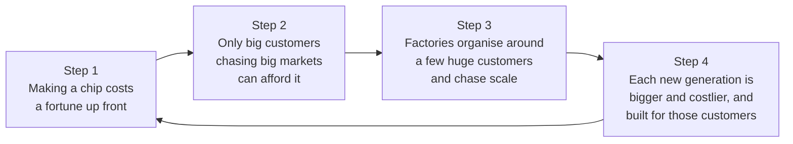

# Breaking silicon's doom spiral

*Why making chips got stuck serving a handful of giants, and why open source, AI and a different kind of chip factory can get it unstuck.*

| | |
|---|---|
| Status | Draft v0.4 |
| Date | 2026-09-13 |
| Audience | People who know how open source, cloud computing and AI changed software, but don't work in the chip industry |

---

## In short

- **Custom chips are for giants.** Designing a chip for your own product, rather than buying one off the shelf, costs so much up front that it is mostly done by large companies chasing huge markets.
- **So chip factories depend on a few customers.** TSMC, the world's largest contract chipmaker, made products for 522 customers in 2024, but its ten largest produced about 76% of that year's revenue.
- **Customers that big set the terms.** They push prices down, shape the factory's plans, and make it afraid of anything that might upset them.
- **Chasing scale is rational, and makes it worse.** Manufacturing costs fall predictably as production piles up, so factories chase the biggest customers and build ever bigger. Each new generation costs even more, and even fewer customers can afford it. This is the doom spiral.
- **The spiral rests on one assumption:** that turning an idea into silicon has to cost a fortune. Open-source chip design tools and AI are now breaking that assumption, as the cloud and open source broke it for software.
- **The way out is a factory built for thousands of small customers**, not a handful of big ones. It would sell machine time openly, let customers experiment at their own expense, and get paid for every attempt, including the many that fail. A few of those attempts will be game-changing.
- **It would earn from the many.** Like Google with its small advertisers, it would make its money from many small customers instead of a few big ones, and learn from all of them.[^anderson]

---

## 1. Software got cheap to try. Chips didn't.

In 2011, Marc Andreessen described what had happened to the cost of starting an internet company:

> "In 2000, when my partner Ben Horowitz was CEO of the first cloud computing company, Loudcloud, the cost of a customer running a basic Internet application was approximately $150,000 a month. Running that same application today in Amazon's cloud costs about $1,500 a month."[^andreessen]

That is a hundredfold drop in about a decade. When Amazon launched its S3 storage service in 2006, developers could "pay only for what they consume and there is no minimum fee", at a published price of $0.15 per gigabyte per month.[^aws] Nobody had to negotiate with a salesperson or sign a long contract to try something.

Open source did the same for the code itself. A 2024 Harvard Business School working paper estimated that firms "would need to spend 3.5 times more on software than they currently do" without open source, and valued widely used open-source software at $8.8 trillion to the companies that use it.[^hbs] That value is very lopsided: the same paper found that 96% of it was created by just 5% of open-source developers.[^hbs]

New ventures have lopsided returns too. In a study of venture-backed start-ups, economists found that "the probabilities of success are low, extremely skewed and unknowable until an investment is made". About 55% were terminated at a loss, while the 6% that returned more than five times their investment produced about half of all the gains.[^nber] That only pays off if a lot of people get to try. The same researchers found that cheaper technology, including "open source software, cloud computing", "has led to an explosion of experimentation with new entrepreneurial ideas".[^nber]

Chips never got that change. The consultancy International Business Strategies estimated that designing a chip costs about $249 million on a 7-nanometre manufacturing process and about $725 million on a 2-nanometre one; Arm quoted these figures in its 2023 IPO prospectus.[^arm] (Each "nanometre" figure names a generation of manufacturing technology. A smaller number means newer and more expensive.) The most advanced chip factories cost about $20 billion each.[^lapedus] TSMC says its total investment in the United States, centred on its factories in Arizona, is expected to reach $165 billion.[^tsmc-az]

Those are costs at the very top of the market. Most chips are not made there. A car "may have some leading-edge chips, but the vast majority of devices are based on mature nodes": older, established manufacturing processes.[^se-mature] But the business model that the top of the market created runs through the whole industry, as the next section shows.

---

## 2. The doom spiral

### Step 1: Making a chip costs a lot before you make a single one

In chip-making, most of the money goes out before the first working chip exists: design engineers, design-software licences, trial manufacturing runs, and the "masks", stencils used to print each layer onto silicon. The industry calls this up-front spending **NRE**, for *non-recurring engineering*. It is the chip equivalent of what software companies used to spend on servers and software licences before writing a line of their own product.

### Step 2: So only big customers can afford it

Contract chipmakers (the industry calls them "foundries") manufacture chips that other companies design. TSMC is the largest, with 70.4% of the market in the last quarter of 2025, according to the research firm TrendForce.[^trendforce] Its 2024 annual filing with the US Securities and Exchange Commission says:

> "While we generate revenue from hundreds of customers worldwide, our ten largest customers in 2022, 2023 and 2024 accounted for approximately, 68%, 70% and 76% of our net revenue in the respective year. Our largest customer in 2022, 2023 and 2024 accounted for 23%, 25% and 22% of our net revenue in the respective year."[^tsmc-20f]

TSMC made products for 522 customers in 2024.[^tsmc-bo] So the other 512 customers together provided about a quarter of its revenue.

Smaller foundries show the same pattern. GlobalFoundries, the world's fifth-largest,[^trendforce] reports that its ten largest customers took 63% of its wafer shipments in 2025. (Wafers are the thin silicon discs that chips are made on.) It also notes that "Nearly all of our customers already maintain their own semiconductor design capability".[^gf-20f] At SkyWater, a much smaller US chipmaker, three customers provided 43%, 21% and 10% of revenue in its 2025 financial year.[^skyt-10k]

### Step 3: So factories chase scale

Chasing scale isn't foolish. It follows one of the best-established patterns in manufacturing. In 1936 the aircraft engineer T. P. Wright showed that labour costs fall along a predictable curve as production accumulates. On his example "eighty percent curve", every time the number of aircraft built doubled, the average labour cost fell to 80% of its previous level.[^wright] This became known as *Wright's law*.

The Boston Consulting Group later extended the idea from labour to a business's overall costs, and called it the "experience curve". The firm's founder, Bruce Henderson, wrote that "Semiconductors provided the evidence on which to build the experience curve concept itself". His firm analysed industry price data in 1966, and one of the two patterns it found was that prices, adjusted for inflation, "declined steadily at a constant rate of about 25 percent each time accumulated experience doubled".[^bcg]

Later researchers put it to the test. A 2013 study tested six forecasting rules against 62 technologies, including memory chips and transistors. It found that "Wright's law produces the best forecasts", though a rule based simply on the passage of time ran it close.[^nagy] Many readers will know the pattern from solar panels, whose "learning rate" is 20%: "with each doubling of the installed cumulative capacity, the price of solar panels declined by 20%."[^owid]

For a chip factory, the implication seems plain. If costs fall as experience piles up, the fastest way to gain experience is to serve the biggest customers. And when a few customers dominate demand, the sensible plan is to build exactly what they need, in the volumes they need, and to push each new generation further to keep them.

The result shows in how few companies can still keep up. The semiconductor journalist Mark LaPedus writes that in 1998, "more than two dozen companies could make chips in their fabs based on the 180nm process, which was the most advanced technology back then." ("Fab" is industry shorthand for a chip factory.) David Schor of WikiChip picks up the story:

> "As of 2020, only three companies are now capable of fabricating integrated circuits on the most cutting-edge process: Intel, Samsung, and TSMC."[^lapedus]

### Step 4: So the next generation costs even more

Every step up in scale raises the price of the next, so fewer customers can follow and the loop tightens. In 2018 GlobalFoundries stopped developing its 7-nanometre process. IEEE Spectrum's subheadline summed it up: "After installing extreme-ultraviolet lithography, foundry finds it doesn't have enough customers for it."[^spectrum-gf] (Extreme-ultraviolet lithography prints the finest patterns on the most advanced chips.)

That is the spiral in one sentence: the technology got so expensive that there weren't enough customers left to pay for it.

---

## 3. What the spiral does to a chip factory's business

### Big customers set the terms

Michael Porter's classic account of competitive strategy describes what powerful customers do: they "capture more value by forcing down prices, demanding better quality or more service (thereby driving up costs), and generally playing industry participants off against one another". Customers have that leverage when "there are few buyers, or each one purchases in volumes that are large relative to the size of a single vendor". And "large-volume buyers are particularly powerful in industries with high fixed costs".[^porter]

A chip factory has very high fixed costs. The building and machines cost the same whether the production lines are busy or idle, so it is worth discounting any large order that keeps them full.

### Losing a big customer can be devastating

Chipmakers say so plainly in their filings:
- **SkyWater:** "A significant portion of our sales are derived from three customers, the loss of which would adversely affect our financial results."[^skyt-10k]
- **GlobalFoundries:** "We depend on a small number of customers for a significant portion of our revenue and any loss of these or our other key customers… could result in significant declines in our revenue."[^gf-20f]

Imagination Technologies shows what that looks like. The British company licensed graphics-chip designs and relied on Apple "for about half of its revenues". In April 2017 Imagination announced that Apple planned to stop using its technology, and its shares fell by as much as 71% in a day.[^cnbc] Imagination designed chips rather than making them, but a chip factory with a customer that size is exposed in exactly the same way.

### Factories get built around their biggest customers

With customers this large, a factory's calendar, capacity and plans follow theirs. TSMC's filing warns that "a more concentrated customer base will subject our revenue to seasonal demand fluctuations from our large customers".[^tsmc-20f] When SkyWater bought Infineon's Fab 25 factory in Austin, Texas, Infineon went from 7% of SkyWater's revenue to 43% in a single year.[^skyt-10k]

The dependence runs both ways. GlobalFoundries explains why customers stay: "Given the time and costs associated with moving a single-sourced product to a competitor, clients are more likely to continue awarding us single-source contracts for such products."[^gf-20f] A chip designed for one factory's process is expensive to move, so the factory and its biggest customers end up locked to each other.

### So they learn not to take risks

If a quarter of your revenue can walk out the door when one customer is unhappy, nothing that might upset that customer is worth trying. Customers depend on a manufacturing process staying exactly as it was when they designed for it. The industry even has a standard for this: J-STD-046, from the standards body JEDEC, sets out how suppliers must notify customers of changes to products and processes.[^jedec]

For the factory, an experiment on behalf of a small customer is all downside: a little revenue, and some risk to the accounts that pay the bills.

### And they have to guess the future

Before anyone can design a chip for a new manufacturing process, the factory has to develop that process. That covers the transistors, the manufacturing rules, and the "process design kit" (PDK): the files and models designers need in order to target the process. The factory does this years before customers use it, and pays for it itself. TSMC spent 7.1% of its 2024 revenue on research and development.[^tsmc-bo] When the guess is wrong, years of investment can go to waste, as GlobalFoundries found with 7 nanometres.[^spectrum-gf]

In effect, the factory does its customers' engineering for them, betting years ahead on what they will want.

---

## 4. The assumption underneath, and why it is breaking down

Everything above rests on one assumption: that turning an idea into silicon has to be expensive. For decades it was. It is getting cheaper, in the same ways software did.

**Open design kits.** In November 2020, Google, SkyWater and a start-up called Efabless announced "the first foundry-supported open source process design kit (PDK) for 130 nm mixed-signal CMOS technologies". They also said open-source designs selected for the programme would be "fabricated at no cost to the designers".[^skywater-pr] GlobalFoundries and IHP, a German research institute, have since released open design kits for their own processes. Both are still labelled as previews and not yet meant for production.[^gf180][^ihp]

**Open design tools.** OpenROAD is an open-source tool chain that turns a chip design into the physical layout a factory manufactures. It was launched in 2018 under a programme of the US Defense Advanced Research Projects Agency (DARPA) that "targets no-human-in-loop (NHIL) design, with 24-hour turnaround time and zero loss of power-performance-area (PPA) design quality".[^openroad] The goal is chip layout that needs neither expensive software licences nor a specialist team.

**Cheap first chips.** Tiny Tapeout, a project that puts many small designs onto one shared chip, charged $300 in 2024 for a slot, including the finished chip and a demo board, or $150 for the first 100 submissions from individuals. Its fifth round had 174 submissions.[^eenews-tt]

**AI.** In 2023, researchers at New York University had a hardware engineer design an 8-bit processor in conversation with ChatGPT-4.[^chipchat] The processor was manufactured on SkyWater's 130-nanometre process through Tiny Tapeout, in what the team described as "the first fully AI-generated HDL sent for fabrication into a physical chip".[^nyu] (HDL, or hardware description language, is the code that describes a chip's circuitry.)

**But the factories haven't changed.** Efabless, which ran many of these programmes, shut down in March 2025. Its chief executive said it had been "unable to complete our latest funding round".[^eenews-efabless] Designing chips is getting cheap, but manufacturing still runs on the old business model, and even a company built around the new tools couldn't raise the money to survive.

---

## 5. A factory for everyone else

If making a chip no longer has to cost a fortune up front, the spiral can run the other way. Cheaper attempts mean more customers. More customers mean none of them dominates. And a factory that no single customer dominates can afford to let customers try strange things.

### The long tail of silicon

In 2004 Chris Anderson, then editor of *Wired*, described a related idea: "the long tail". When it becomes cheap to stock and deliver niche products, many products that each sell little can add up to a big market. In his words, "If the 20th-century entertainment industry was about hits, the 21st will be equally about misses."[^anderson] He described Google as making "most of its money off small advertisers (the long tail of advertising)".[^anderson]

Wider choice has real value. Economists estimated that the far wider range of books available from online bookstores "enhanced consumer welfare by $731 million to $1.03 billion in the year 2000". That was "between 7 and 10 times as large as the consumer welfare gain from increased competition and lower prices".[^bhs]

Chip factories have a tail too. TSMC's 512 customers outside its top ten share about a quarter of its revenue (see Step 2). But the tail ends at the customers who can afford the up-front cost. Ideas that never became chips, because they cost too much to try, don't show up in anyone's revenue at all.

The long tail has a well-known critic. Anita Elberse of Harvard Business School looked at an online music service with more than a million tracks and found that "the top 10% of titles accounted for 78% of all plays, and the top 1% of titles for 32% of all plays". Hits still dominate.[^elberse]

But the argument for an open chip factory doesn't need the tail to outsell the hits. It needs three more modest things. Each small customer must be profitable on its own, which is far more achievable when the factory does no engineering for them. Many small customers must spread the risk, so that no single one can hurt the factory. And the tail must keep producing experiments, a few of which grow into the next big customers.

### Learning from many small attempts

Those experiments matter for a second reason: learning. Step 3 described how costs fall as experience piles up, which is why factories chase scale. But Wright's law counts units, and what counts as a unit matters. A 2020 article in *Science* compared energy technologies ranging from solar panels, e-bikes and smart thermostats to carbon capture and storage. Its authors found that "learning is faster for more-granular energy technologies": the smaller, cheaper and more numerous the units, the faster costs fell. They concluded that, "Under certain conditions", such technologies are "empirically associated with faster diffusion, lower investment risk, faster learning" and more.[^wilson]

Our argument is that chip-making has ridden the experience curve on wafers, but not on ideas. In our view, custom designs and new process experiments each happen in small numbers and in secret, so what one team learns adds little to anyone else's experience. A factory running thousands of small, public experiments would pile up experience far faster, and share it, as open source did for software.

### Four ideas for the factory

**1. Stop doing the customers' engineering.** The factory runs its machines safely and well. Customers develop their own processes, test their own ideas and analyse their own results, at their own expense. The factory stops guessing, years ahead, what everyone will want. For example, a customer who wants to try a new material rents time on the machines it needs, tries its own settings within the limits that keep the machines safe, measures the results, and pays for every hour whether or not the experiment works.

**2. Get paid for every attempt.** Customers pay for machine time whether or not their idea works. Most ideas won't, and that's fine for two reasons: the factory was paid to try them, and a few of them will be game-changing. A cloud provider was paid for the servers of every start-up that failed, and hosted the few that didn't.

**3. Many customers, or it doesn't work.** With thousands of small ones, no customer has the leverage to squeeze margins, losing any one of them is barely noticeable, and the factory no longer needs to be afraid.

**4. Openness is how you get those customers.** Small players with unusual ideas won't queue up for a black box with negotiated prices and hidden waiting lists. Published prices, visible queues and public results let anyone try something without asking permission. Published, pay-as-you-go pricing did the same for cloud computing.

---

## 6. "It can't work"

People inside the chip industry will say this model can't work. They are describing the industry they know: the one the spiral built. Run a factory the way the industry runs factories, and you get the results the industry gets.

The usual objections, briefly:

- **"Small customers don't pay the bills."** One at a time, they don't, so the model mustn't make each one expensive to serve. Cloud computing made the same shift, from negotiated contracts to published prices anyone can pay.[^aws]
- **"Most of their ideas won't work."** True, and it doesn't matter to the factory's income. Most start-ups don't work either: in the venture-backed start-ups studied, about 55% ended at a loss.[^nber] The value comes from the few that don't, and from the fact that everyone got to try.
- **"You can't let customers loose on a factory's processes."** The factory still protects its machines and never runs anything that would damage them. Everything else, including whether a customer's idea works, is the customer's risk, not the factory's.

---

## What comes next

This document is about *why*. A separate draft, `PRINCIPLES.md`, sets out *how* a factory like this would operate: how machine time is sold, who pays when things go wrong, and what the factory itself does and doesn't decide.

---

## Sources

[^andreessen]: Marc Andreessen, "Why Software Is Eating the World", *The Wall Street Journal*, 20 August 2011. Republished by Andreessen Horowitz: <https://a16z.com/why-software-is-eating-the-world/>

[^aws]: Amazon, "Amazon Web Services Launches" (Amazon S3 press release), 14 March 2006: <https://press.aboutamazon.com/2006/3/amazon-web-services-launches>

[^nber]: William R. Kerr, Ramana Nanda and Matthew Rhodes-Kropf, "Entrepreneurship as Experimentation", NBER Working Paper 20358, 2014 (published in the *Journal of Economic Perspectives* 28(3)): <https://www.nber.org/system/files/working_papers/w20358/w20358.pdf>

[^hbs]: Manuel Hoffmann, Frank Nagle and Yanuo Zhou, "The Value of Open Source Software", Harvard Business School Working Paper 24-038, 2024: <https://www.hbs.edu/ris/Publication%20Files/24-038_51f8444f-502c-4139-8bf2-56eb4b65c58a.pdf>

[^arm]: Arm Holdings plc, prospectus (Form 424B4) filed with the US SEC, September 2023, citing International Business Strategy, Inc.: <https://www.sec.gov/Archives/edgar/data/1973239/000119312523235320/d550931d424b4.htm>

[^lapedus]: Mark LaPedus, "Will the U.S. CHIPS Act Succeed?", *Semiecosystem*, 25 May 2024 (quoting WikiChip's David Schor): <https://marklapedus.substack.com/p/will-the-us-chips-act-succeed>

[^tsmc-az]: TSMC, "TSMC Intends to Expand Its Investment in the United States to US$165 Billion to Power the Future of AI", 4 March 2025: <https://pr.tsmc.com/english/news/3210>

[^tsmc-20f]: Taiwan Semiconductor Manufacturing Company, Annual Report on Form 20-F for 2024, filed with the US SEC on 17 April 2025 (risk factors, and note 38 "Operating Segments Information"): <https://www.sec.gov/Archives/edgar/data/1046179/000119312525083423/d896993d20f.htm>

[^se-mature]: Mark LaPedus, "Chip Shortages Grow For Mature Nodes", *Semiconductor Engineering*, 22 July 2021: <https://semiengineering.com/chip-shortages-grow-for-mature-nodes/>

[^trendforce]: TrendForce, "AI Demand Drives 4Q25 Global Top 10 Foundries Revenue Up 2.6% QoQ", 12 March 2026: <https://www.trendforce.com/presscenter/news/20260312-12965.html>

[^tsmc-bo]: TSMC, *2024 Business Overview*, published 2025: <https://investor.tsmc.com/sites/ir/annual-report/2024/2024%20Business%20Overview_0.pdf>

[^gf-20f]: GlobalFoundries Inc., Annual Report on Form 20-F for 2025, filed with the US SEC on 27 February 2026: <https://www.sec.gov/Archives/edgar/data/1709048/000170904826000022/gfs-20251231.htm>

[^skyt-10k]: SkyWater Technology, Inc., Annual Report on Form 10-K for the fiscal year ended 28 December 2025, filed with the US SEC on 11 March 2026: <https://www.sec.gov/Archives/edgar/data/1819974/000181997426000009/skyt-20251228.htm>

[^wright]: T. P. Wright, "Factors Affecting the Cost of Airplanes", *Journal of the Aeronautical Sciences* 3(4), February 1936, pp. 122–128: <https://pdodds.w3.uvm.edu/research/papers/others/1936/wright1936a.pdf>

[^bcg]: Bruce Henderson, "The Experience Curve—Reviewed (Part II)", Boston Consulting Group, 1 January 1973: <https://www.bcg.com/publications/1973/corporate-finance-strategy-portfolio-management-experience-curve-reviewed-part-ii-the-history>

[^nagy]: Béla Nagy, J. Doyne Farmer, Quan M. Bui and Jessika E. Trancik, "Statistical Basis for Predicting Technological Progress", *PLOS ONE* 8(2): e52669, 2013: <https://journals.plos.org/plosone/article?id=10.1371/journal.pone.0052669>

[^owid]: Max Roser, "Learning curves: What does it mean for a technology to follow Wright's Law?", Our World in Data, 18 April 2023: <https://ourworldindata.org/learning-curve>

[^spectrum-gf]: Samuel K. Moore, "GlobalFoundries Halts 7-Nanometer Chip Development", *IEEE Spectrum*, 28 August 2018: <https://spectrum.ieee.org/globalfoundries-halts-7nm-chip-development>

[^porter]: Michael E. Porter, "The Five Competitive Forces That Shape Strategy", *Harvard Business Review*, January 2008: <https://hbr.org/2008/01/the-five-competitive-forces-that-shape-strategy>

[^cnbc]: Karen Gilchrist, "Imagination Technologies shares plunge as much as 71 percent after Apple ends chip deal", CNBC, 3 April 2017: <https://www.cnbc.com/2017/04/03/imagination-technologies-shares-plunge-69-percent-after-apple-withdraws.html>

[^jedec]: JEDEC, "J-STD-046: Customer Notification Standard for Product/Process Changes by Electronic Product Suppliers" (current revision J-STD-046A, December 2025): <https://www.jedec.org/standards-documents/docs/j-std-046>

[^skywater-pr]: SkyWater Technology, "Google Partners with SkyWater and Efabless to Enable Open Source Manufacturing of Custom ASICs", 12 November 2020: <https://www.skywatertechnology.com/google-partners-with-skywater-and-efabless-to-enable-open-source-manufacturing-of-custom-asics/>

[^gf180]: Google and GlobalFoundries, GF180MCU open-source PDK repository (see "Current Status -- Experimental Preview"): <https://github.com/google/gf180mcu-pdk>

[^ihp]: IHP, IHP Open Source PDK repository for its 130 nm BiCMOS process: <https://github.com/IHP-GmbH/IHP-Open-PDK>

[^openroad]: The OpenROAD Project, documentation home page: <https://openroad.readthedocs.io/en/latest/>

[^eenews-tt]: Nick Flaherty, "Round 6 opens for Tiny Tapeout low cost ASICs", *eeNews Europe*, 2 February 2024: <https://www.eenewseurope.com/en/round-6-opens-for-tiny-tapeout-low-cost-asics/>

[^chipchat]: Jason Blocklove, Siddharth Garg, Ramesh Karri and Hammond Pearce, "Chip-Chat: Challenges and Opportunities in Conversational Hardware Design", arXiv:2305.13243, 2023: <https://arxiv.org/abs/2305.13243>

[^nyu]: NYU Tandon School of Engineering, "Chip Chat: Conversations with AI models can help create microprocessing chips, NYU Tandon researchers discover", 5 June 2023: <https://engineering.nyu.edu/news/chip-chat-conversations-ai-models-can-help-create-microprocessing-chips-nyu-tandon-researchers>

[^anderson]: Chris Anderson, "The Long Tail", *Wired*, October 2004: <https://www.wired.com/2004/10/tail/>

[^bhs]: Erik Brynjolfsson, Yu (Jeffrey) Hu and Michael D. Smith, "Consumer Surplus in the Digital Economy: Estimating the Value of Increased Product Variety at Online Booksellers", *Management Science* 49(11), 2003, pp. 1580–1596 (abstract): <https://econpapers.repec.org/RePEc:inm:ormnsc:v:49:y:2003:i:11:p:1580-1596>

[^elberse]: Anita Elberse, "Should You Invest in the Long Tail?", *Harvard Business Review*, July–August 2008: <https://hbr.org/2008/07/should-you-invest-in-the-long-tail>

[^wilson]: Charlie Wilson, Arnulf Grubler, Nuno Bento, Steve Healey, Simon De Stercke and Caroline Zimm, "Granular technologies to accelerate decarbonization", *Science* 368(6486), 2020, pp. 36–39: <https://www.science.org/doi/10.1126/science.aaz8060> (authors' manuscript: <https://pure.iiasa.ac.at/id/eprint/16400/1/Granularity_Manuscript_preprint.pdf>)

[^eenews-efabless]: Nick Flaherty, "Tiny Tapeout hit as eFabless closes", *eeNews Europe*, 2 March 2025: <https://www.eenewseurope.com/en/tiny-tapeout-hit-as-efabless-closes/>
